# Exercises

The full set of exercises below covers most of what seems relevant. When normal condition is restored, the simpified quick subset for 2-3 minutes every morning: [U1-1](#u1-1-), [U1-2](#u1-2-), [U1-3](#u1-3), [U1-4](#u1-4).

## D1-1

<!-- 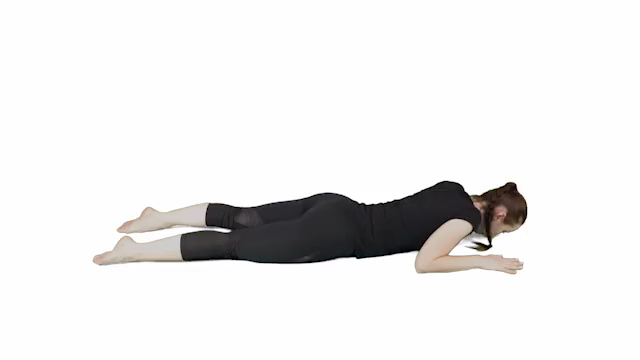 -->

<video controls width="640">
  <source src="media/d1-1.mp4" type="video/mp4">
  Your browser doesn't support video playback.
</video>

**Note: calm and smooth movements. Self-massage: at the start and during pauses one hand may reach and touch the back to help relax the muscles along the spine.**

---

## D1-2

<!-- 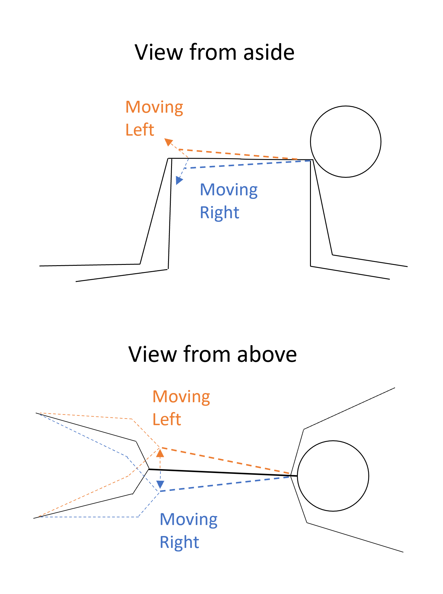{: width="50%"} -->

Calm and smooth movements that usually don't provoke extra pain and tend to provide a moderate relief.

---

## U1-1 !

<!-- 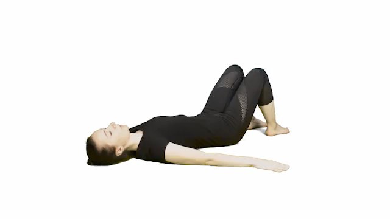 -->

<video controls width="640">
  <source src="media/u1-1.mp4" type="video/mp4">
  Your browser doesn't support video playback.
</video>

**Note: when the legs move in one direction, the chest and arms can gently be turned to the opposite direction. The movements should be slow, calm, and smooth. As the legs are turned in one direction there may be a pause: the opposite hand may reach and touch the back to help relax the muscles along the spine.**

---

## U1-2 !

<!-- 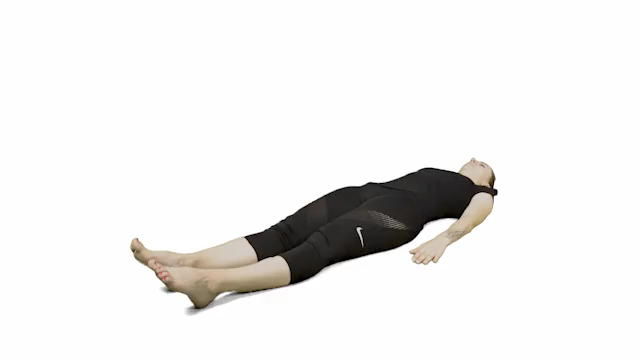 -->

<video controls width="640">
  <source src="media/u1-2.mp4" type="video/mp4">
  Your browser doesn't support video playback.
</video>

**Note: compared to the video, each movement should be slower and more substantial, with sufficient stretch and relaxation.**

---

## U1-3

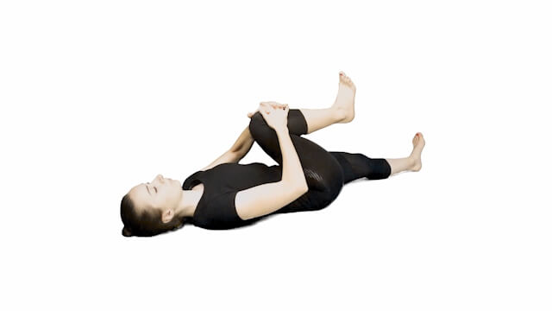

Full version:
* Right leg (2-3 times)
  * inhale and hold
  * push the leg to the right and feetward (3-5 sec)
  * exhale, relax and pull slightly to the left and headward
* Left leg (2-3 times)
  * inhale and hold
  * push the leg to the left and feetward (3-5 sec)
  * exhale, relax and pull slightly to the right and headward

Quicker version: 1 time/rep for each leg.

---

## U1-4

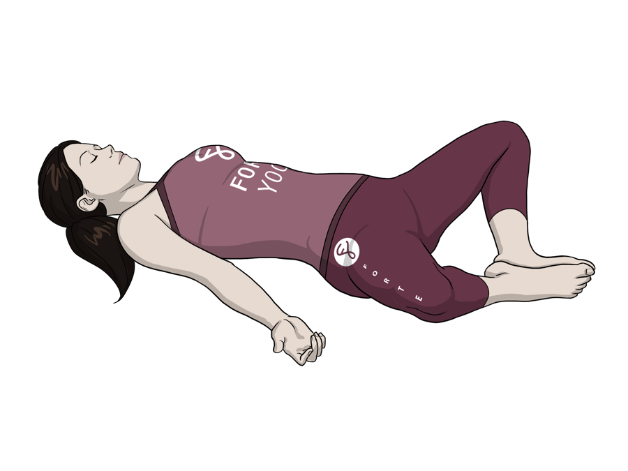

Not exactly but almost like that :)

---

## U1-5

<!-- 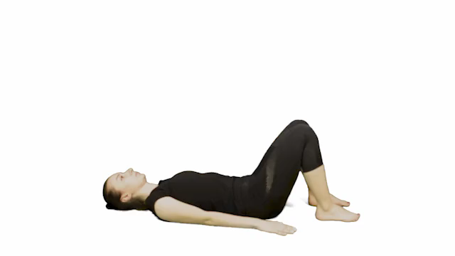 -->

<video controls width="640">
  <source src="media/u1-5.mp4" type="video/mp4">
  Your browser doesn't support video playback.
</video>

---

## D1-3

<!-- 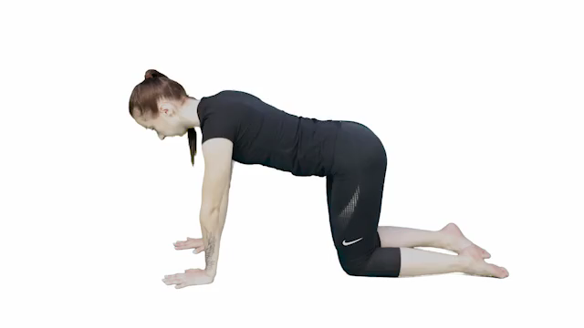 -->

<video controls width="640">
  <source src="media/d1-3.mp4" type="video/mp4">
  Your browser doesn't support video playback.
</video>

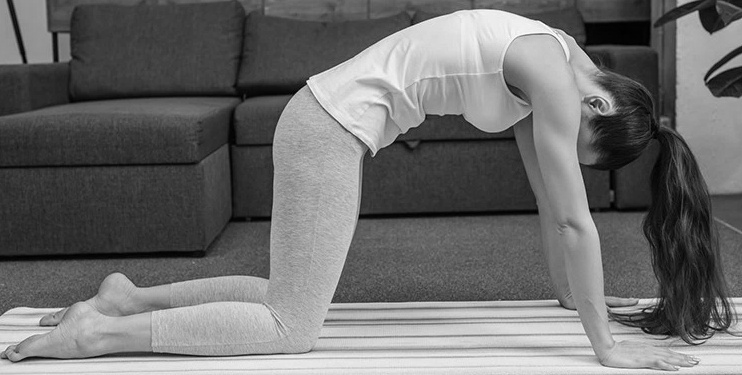

---

## D1-4

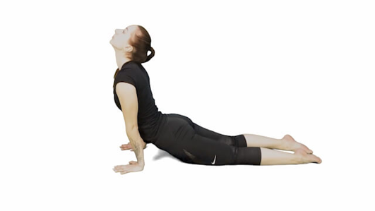

<!-- 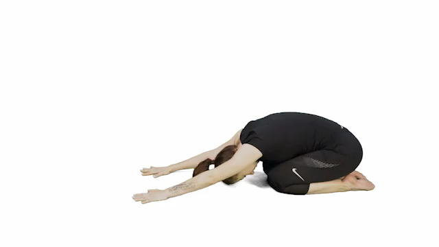 -->

<video controls width="640">
  <source src="media/d1-4.mp4" type="video/mp4">
  Your browser doesn't support video playback.
</video>

---

## D1-5

<!-- 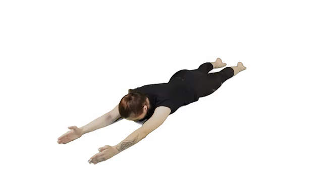 -->

<video controls width="640">
  <source src="media/d1-5.mp4" type="video/mp4">
  Your browser doesn't support video playback.
</video>

---

## D2-6

**Start with a few reps of D1-3:**

<!--  -->

<video controls width="640">
  <source src="media/d1-3.mp4" type="video/mp4">
  Your browser doesn't support video playback.
</video>

**Make the spine straight:**

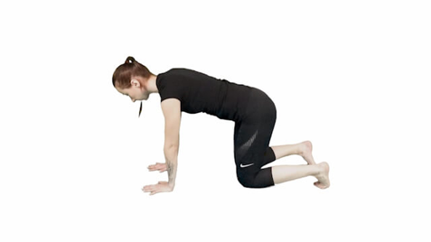

**Do this carefully several times:**

<!-- 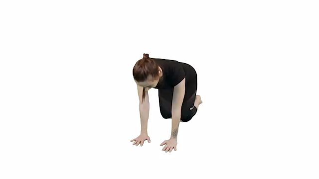 -->

<video controls width="640">
  <source src="media/d2-6.mp4" type="video/mp4">
  Your browser doesn't support video playback.
</video>

---